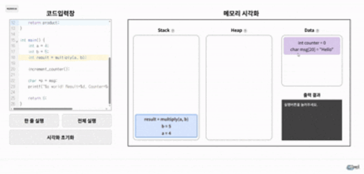

<div align="center">

# 🔎 CeeVizor

코드 실행 흐름과 메모리 구조를 직관적으로 시각화하는 교육용 도구  
코딩 언어 프로그램의 **Stack / Heap / Data** 영역 변화를 실행 단계별로 추적하고 시각화합니다.


<p align="center">
  
</p>

<p align="center">
  [시연 영상 보러가기](유튜브링크)
</p>

</div>


## 🔎 프로젝트 개요 (Project Overview)
* 프로젝트명: **"CeeVizor: 코드 실행 흐름과 메모리 구조를 시각화 하는 도구"**
* 목적: 프로그래밍 학습자가 메모리 구조와 실행 흐름을 시각적으로 이해하도록 지원
* 특징: 단순 출력이 아닌 실행 중 메모리 변화를 단계별로 확인
<br>


## 🔥 주요 기능 (Key Features)
-  **C 코드 실행 및 시각화** (추후 Python, Java 등 언어 확장 예정)
-  **Tree-sitter** 기반 정적 분석으로 변수/함수 파싱
-  **GCC + GDB** 기반 코드 흐름 동적 추적 (실행 흐름, 스택 프레임, 힙 할당/해제)
-  **Stack / Heap / Data** 메모리 단계별 갱신 후 시각화
-  **React UI + D3.js** 인터랙티브 시각화
<br>


## 🛠 시스템 아키텍처 (System Architecture)

```
[React Frontend]  ◀──▶  [FastAPI Backend]
        │                    │
        │    POST /compile   ├─ GCC 컴파일 / 실행
        │                    ├─ GDB 실행 추적(타임라인)
        │                    └─ Tree-sitter 정적 분석
        ▼
[메모리 변화 JSON]  →  시각화(Render)
```
<br>

## 🛠 기술 스택 (Tech Stack)

| 분류          | 내용 |
|---------------|------------------------------------------------|
| 환경          | Windows 11, WSL (Ubuntu 24.04.3 LTS) |
| 개발 언어     | Python (3.12.3), JavaScript |
| 주요 라이브러리 | React, FastAPI, D3.js |
| 도구 및 시스템 | GCC, GDB, Tree-Sitter, Docker, Npm |
| 버전 관리     | Git, GitHub |
<br>

## ⚙️ 설치 및 실행 (Windows)
<details> <summary>🔽 Windows 설치 가이드</summary>
  
### 🐋 도커 설치

1. [Docker Desktop](https://www.docker.com/products/docker-desktop/) : 도커 데스크탑 설치
2. 설치 중 WSL2 Backend 옵션 유지 **(권장)**
3. 설치 후 **Docker Desktop** 실행

4. PowerShell에서 설치, 버전 확인

```powershell
docker --version
```

---

### 프로그램 실행 (Docker Hub 사용)

1. PowerShell 열고 이미지 받기

```powershell
docker pull kimbyeongmo/ceevizor:latest
```

2. 컨테이너 실행

```powershell
docker run -p 8000:8000 kimbyeongmo/ceevizor:latest
```

3. 브라우저 접속

* 로컬 호스트 주소

   [http://localhost:8000](http://localhost:8000)

* 호스트PC IP 주소 (로컬 호스트 주소 오류 시)

```
http://<호스트PC_IP>:8000
```
_Windows 방화벽이 막는 경우 인바운드 규칙으로 TCP 8000 허용 필요._

---

### 프로그램 직접 빌드 후 실행 (Dockerfile 사용)

1. PowerShell에서 프로젝트 루트로 이동 후 빌드

```powershell
docker build -t ceevior .
```

2. 실행

```powershell
docker run -p 8000:8000 ceevizor
```

3. 브라우저 접속

* 로컬 호스트 주소

   [http://localhost:8000](http://localhost:8000)

* 호스트PC IP 주소 (로컬 호스트 주소 오류 시)

```
http://<호스트PC_IP>:8000
```
_Windows 방화벽이 막는 경우 인바운드 규칙으로 TCP 8000 허용 필요._
</details>

## ⚙️ 설치 및 실행 (Ubuntu)
<details> <summary>🔽 Ubuntu 설치 가이드</summary>

### 🐋 도커 설치

1. 기존 도커 제거 (필요시)

```bash
sudo apt remove -y docker docker-engine docker.io containerd runc
```

2. 패키지 준비

```bash
sudo apt update
sudo apt install -y ca-certificates curl gnupg
```

3. Docker GPG 키 등록

```bash
// 디렉토리 생성
sudo install -m 0755 -d /etc/apt/keyrings

//GPG 키 받아서 변환 후 저장
curl -fsSL https://download.docker.com/linux/ubuntu/gpg | sudo gpg --dearmor -o /etc/apt/keyrings/docker.gpg

//권한 부여
sudo chmod a+r /etc/apt/keyrings/docker.gpg
```

4. Docker 레포지토리 추가

```bash
echo "deb [arch=$(dpkg --print-architecture) signed-by=/etc/apt/keyrings/docker.gpg] \
https://download.docker.com/linux/ubuntu $(lsb_release -cs) stable" | \
sudo tee /etc/apt/sources.list.d/docker.list > /dev/null
```

5. Docker 설치

```bash
sudo apt update
sudo apt install -y docker-ce docker-ce-cli containerd.io docker-buildx-plugin docker-compose-plugin
```

6. 서비스 시작

```bash
sudo service docker start
```

7. 버전 확인

```
docker --version
```

---

### 프로그램 실행 (Docker Hub 사용)

1. 이미지 받기

```
docker pull kimbyeongmo/ceevizor:latest
```

2. 컨테이너 실행

```bash
sudo docker run -p 8000:8000 kimbyeongmo/ceevizor:latest
//만약 sudo 없이 쓰고 싶다면 sudo usermod -aG docker $USER 후 재로그인
```

3. 브라우저 접속

* 로컬 호스트 주소

   [http://localhost:8000](http://localhost:8000)

* 호스트PC IP 주소 (로컬 호스트 주소 오류 시)

```
http://<호스트PC_IP>:8000
```

---

### 프로그램 직접 빌드 후 실행 (Dockerfile 사용)

프로젝트 루트에 있는 Dockerfile 기준

1. 프로젝트 파일 빌드

```bash
sudo docker build -t ceevizor .
```

2. 프로젝트 실행

```bash
sudo docker run -p 8000:8000 ceevizor
```

3. 브라우저 접속

* 로컬 호스트 주소

   [http://localhost:8000](http://localhost:8000)

* 호스트PC IP 주소 (로컬 호스트 주소 오류 시)

```
http://<호스트PC_IP>:8000
```
</details>
<br>

## 👨‍💻 팀 (Team Members)

| 이름 | 역할 |
|------|------|
| 🛠️ 김병모 | **Tree-sitter**, **GCC**, **GDB** 구현 |
| ⚡ 최강우 | **FastAPI 설계**, GCC/GDB 로그 최적화 |
| 🎨 허준혁 | **시각화 및 애니메이션 (D3.js)** |
| 💻 김현송 | **UI/UX 설계 및 구현 (React)** |
<br>


## 📈 기대효과 (Expected Outcomes)

-  **메모리 구조 변화**를 직관적으로 이해 → 학습 효과 증대  
-  **포인터, 동적 메모리, 함수 호출 스택** 등 복잡한 개념을 시각적으로 습득  
-  **코드 실행 결과 + 내부 동작** 확인 → 디버깅 교육, 시뮬레이션 강의 자료에 활용  
<br>


## 🔮 향후 개선 방향 (Future Improvements)

-  **다언어 지원** (C++ / Python / Java)  
-  **가이드 모드 / 포인터 집중 모드** 제공  
-  **AI 도우미** (힌트 제공, 코드 리팩터링 지원)  
<br>


## 📄 라이선스 (License)

본 프로젝트는 **MIT License**를 따릅니다.
